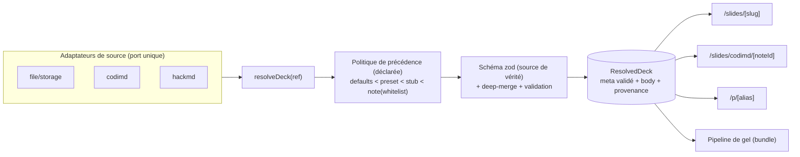
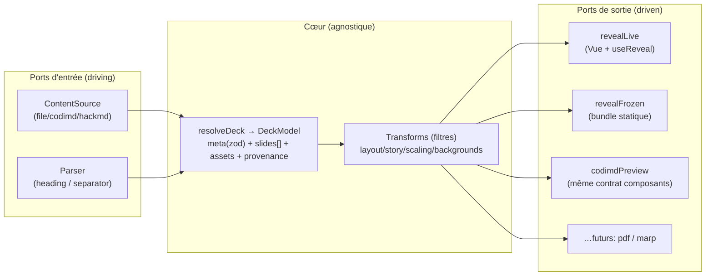

# Audit architectural — nuxt-slides (juin 2026)

> Audit conduit après une série de blocages en production (404 d'alias, marges
> non appliquées, iframes Storybook cassées, déploiement vide). La thèse de cet
> audit : **ces incidents ne sont pas des bugs isolés, ce sont les symptômes
> répétés d'un même défaut structurel** — un même concept (« la configuration
> effective d'un deck ») est ré-implémenté différemment à chaque endroit où il
> est nécessaire. La difficulté à itérer vient de là.

Cet audit s'appuie sur des systèmes analogues éprouvés : **Astro Content
Collections / Live Collections**, **Nuxt Content** (sources distantes + schéma
zod), le **preparser de Slidev**, **Style Dictionary** (pipeline de tokens), et —
pour la **surface de sortie** — l'architecture de **Pandoc** (*readers → AST →
writers*) et le patron **Ports & Adapters / Clean Architecture**.

> **Mise à jour (consolidation).** Une première version couvrait l'entrée et la
> résolution (sources, config, theming, cycle de vie). Cette version intègre la
> **transformation finale** : le **parser** (entrée) et les **cibles de rendu**
> (sortie) — Reveal.js live, prérendu SSG, bundle gelé, **et** la preview CodiMD
> qui ré-implémente déjà un parser légèrement différent. Ces surfaces sont, elles
> aussi, des candidats naturels à des **adaptateurs/presenters**.

> **Mise à jour (2e consolidation).** Cette version ajoute trois angles : (1)
> **Storybook** comme **dépendance externe** traitée comme asset embarqué (Axe H,
> §3.8) ; (2) une **stratégie de test** (§6) — à la fois *preuve de sanité* de
> l'archi cible **et** *filet* pour migrer sans casser les decks en prod ; (3) la
> piste d'un **éditeur Markdown intégré** en remplacement de CodiMD distant
> (§5.10), qui — loin d'affaiblir l'abstraction — en est le **bénéficiaire le plus
> direct**.

---

## 1. Résumé exécutif

Le projet fait, au fond, **une seule chose** : transformer un document Markdown
(+ frontmatter + composants MDC) en un deck Reveal.js thémé, à partir de sources
variées (fichier local, note CodiMD/HackMD), pour plusieurs cibles (live SSR,
prérendu SSG, bundle gelé autoportant).

Le problème n'est pas la complexité intrinsèque du domaine — elle est réelle et
légitime. Le problème est que cette complexité est **dispersée et dupliquée** au
lieu d'être **nommée et centralisée**. Concrètement :

- **3 routes de rendu** (`/slides/[slug]`, `/slides/codimd/[noteId]`,
  `/p/[alias]`) résolvent la configuration d'un deck avec **3 logiques de merge
  différentes** (shallow côté client, « frontmatter local gagne », « frontmatter
  note gagne en deep-merge », « stub + override ciblé »). Voir le tableau §3.2.
- Les **presets de thème sont dupliqués** : une version partielle côté client
  ([src/config/presentation.ts](../src/config/presentation.ts)), une version
  complète ré-écrite à la main côté serveur
  ([server/api/codimd/[noteId].get.ts](../server/api/codimd/%5BnoteId%5D.get.ts)).
- Le **frontmatter est manipulé par regex ad hoc** dans au moins 5 endroits
  (parse plat, strip, set scalaire, sérialiseur YAML maison, merge par
  concaténation de chaînes).
- Le **theming est éclaté** entre SCSS (`themes/`) et TS (`THEME_BACKGROUNDS`,
  `DEFAULT_REVEAL_CONFIG`), sans source de vérité unique ni validation du nom de
  thème.
- La **sortie est dupliquée** : trois cibles de rendu (live SSR, prérendu SSG,
  bundle gelé) ré-implémentent l'init Reveal, le re-basage d'assets et le scaler
  d'iframe ; et la **preview CodiMD est un second parser qui dérive déjà** (format
  d'icônes, `::Image`, composants fantômes). Aucun **modèle de deck normalisé**
  (IR) ne sert de point de passage. Voir Axe G (§3.7).
- L'**infrastructure embarque des opinions métier** : le cycle de vie
  (live/frozen/archived), le contrôle d'accès (dossiers public/draft/private),
  et la diffusion (submodule privé + token + script de clone) sont enchevêtrés
  avec les mécanismes de stockage/hébergement.
- **Storybook est une dépendance externe sans port** : il n'est pas un module de
  ce dépôt mais un artefact tiers publié, câblé en dur pour les iframes *live* et
  re-bricolé par **4 scripts** au gel (Axe H, §3.8). C'est la racine de la classe
  de bugs d'iframes.
- **Aucun harnais de test n'existe** (ni `vitest`, ni golden, ni script `test`) :
  on ne peut pas, en l'état, **prouver** qu'une refonte ne casse pas les decks en
  production — d'où une **stratégie de test préalable** (§6).

**Conséquence directe sur l'itération** : pour comprendre « pourquoi ce deck
s'affiche comme ça », il faut tenir en tête 5 surfaces de configuration et 3
chemins de code. Pour corriger un comportement, il faut souvent le corriger à
plusieurs endroits (ex. un preset, ou une logique de merge). C'est exactement ce
qu'on a vécu : la marge a été ignorée parce que le chemin CodiMD parsait le
frontmatter en *flat* et écrasait avec un preset sans `margin` ; l'URL Storybook
divergeait parce que la précédence stub/note n'est pas la même selon la route.

La recommandation centrale tient en une phrase : **introduire un unique
« résolveur de deck » (un pipeline nommé) avec des adaptateurs de source et un
schéma de validation unique**, puis faire converger les 3 routes et le pipeline
de gel sur ce résolveur. Le reste (theming en tokens, source distante de
première classe) en découle.

---

## 2. Symptômes observés → causes racines

Les incidents récents sont la meilleure preuve empirique. Chacun remonte à un
défaut structurel, pas à une erreur ponctuelle.

| Incident (vécu) | Cause immédiate | Cause racine architecturale |
|---|---|---|
| **Marges non appliquées** sur `/slides/codimd/<id>` | `parseFlatFrontmatter` ne lisait que les clés plates ; le preset serveur n'avait pas de `margin` et écrasait | **Pas de modèle de frontmatter typé** + **presets dupliqués** + **merge ad hoc** (3 défauts en un) |
| **Iframes Storybook cassées** sur `/p/<alias>` mais OK sur `/slides/codimd/` | le stub portait `storybook: localhost`, la note portait l'URL publique | **Précédence de config divergente** entre routes (pas de politique unique) |
| **Alias `/p/` en 404** en prod | lecture FS via `getPresentationsDir()` (heuristique `cwd.includes('.output')`) cassée en serverless | **Pas d'abstraction d'accès au contenu** (chemin FS codé en dur) |
| **Déploiement « vide »** (tout 404) | token expiré → `fetch-presentations.js` clone échoue et **continue en silence** | **Infra qui embarque du métier** + **dégradation silencieuse** (pas de fail-closed) |
| **Marges OK en local, KO en prod** (au départ) | dev lit le working tree, prod lit un build/preset différent | **Surfaces de config multiples** selon l'instance |

Lecture transversale : sur 5 incidents, **4 touchent la résolution de
configuration / la source de contenu**. Ce n'est pas un hasard — c'est le cœur
non-abstrait du système.

---

## 3. Diagnostic par axe

### 3.1 Axe A — Résolution de configuration dispersée et dupliquée

**Constat.** La « config effective » d'un deck (thème, reveal, backgrounds,
storybook, accès, parser…) est calculée à des endroits différents avec des
sémantiques différentes :

- Côté client, merge **shallow** :
  [usePresentation.ts](../src/composables/usePresentation.ts) fait
  `{ ...DEFAULT_METADATA, ...ast.data }`.
- Côté serveur `/api/codimd/[noteId]`, merge **deep** maison (`deepMerge`) par
  dessus un **preset dupliqué** ré-écrit à la main.
- Côté serveur `/api/presentations/[slug]` et `/api/p/[alias]`, **concaténation
  de chaînes** (`mergeCodiMDContent`) : « on garde le frontmatter local, on
  prend le corps distant », plus un **override ciblé** (`setFrontmatterScalar`
  pour `storybook`).
- `DEFAULT_REVEAL_CONFIG` est re-mergé **une seconde fois** dans
  [RevealPresentation.vue](../src/components/RevealPresentation.vue) et
  [useReveal.ts](../src/composables/useReveal.ts), puis re-sérialisé en
  `data-reveal-config` pour les bundles gelés.

**Tableau des précédences actuelles (extrait de la cartographie) :**

| Route | Base | Couche 1 | Couche 2 | Type de merge |
|---|---|---|---|---|
| `/slides/[slug]` | `DEFAULT_METADATA` | frontmatter stub | corps CodiMD (si remote) | shallow (client) |
| `/api/presentations/[slug]` | — | frontmatter stub | corps CodiMD (local gagne) | concat de chaînes |
| `/api/codimd/[noteId]` | preset (query) | frontmatter note | swap de thème | **deep** |
| `/p/[alias]` | frontmatter stub | corps note | override `storybook` | concat + override |

**Pourquoi c'est un défaut.** Il n'existe nulle part de réponse unique à « quelle
est la config de ce deck ? ». La même note CodiMD, vue par deux routes, ne donne
pas le même frontmatter. Toute évolution (un nouveau champ, une nouvelle règle de
précédence) doit être répliquée et risque de diverger — c'est la source directe
des bugs marges et storybook.

### 3.2 Axe B — Sourcing de contenu sans abstraction

**Constat.** Trois manières d'obtenir le corps d'un deck (fichier local via
storage, CodiMD `/download`, HackMD API) sont câblées en dur, route par route,
sans interface commune. Le cache (`CACHE_TTL_MS = 10_000`) est dupliqué dans
[registry.ts](../server/utils/registry.ts) et
[codimd.ts](../server/utils/codimd.ts). L'accès local est passé d'un chemin FS
fragile (`getPresentationsDir`) à `useStorage('assets:presentations')` — bon
réflexe, mais c'est encore un accès direct, pas un *port* nommé.

**Pourquoi c'est un défaut.** Ajouter une source (Google Docs, un autre wiki, un
fichier distant) impose de toucher plusieurs handlers. La gestion d'erreur,
le cache et la fraîcheur ne sont pas factorisés. Le 404 prod (heuristique de
chemin) est précisément le coût de l'absence d'un port d'accès au contenu.

### 3.3 Axe C — Absence de modèle de données (frontmatter = chaînes + regex)

**Constat.** Le frontmatter est traité comme du texte : `parseFlatFrontmatter`
(regex, clés plates uniquement), `stripFrontmatter` (regex), `setFrontmatterScalar`
(regex replace/append), un `toYaml` **maison** (qui ne gérait pas les tableaux
avant correctif), et un merge par concaténation. Aucun schéma ne décrit ce qu'est
un frontmatter valide. Le nom de thème est une chaîne libre, jamais validée
contre `public/themes/`.

**Pourquoi c'est un défaut.** Les invariants ne sont pas exprimés ni vérifiés.
Le bug des marges est exactement ça : un parseur *flat* a silencieusement ignoré
un bloc imbriqué (`reveal.margin`). Une typo `theme: lea` échoue sans bruit. Il
n'y a pas de garde-fou ni de types dérivés automatiquement.

### 3.4 Axe D — Theming éclaté entre SCSS et TS

**Constat.** La vérité d'un thème est répartie :

- SCSS : `themes/<t>/<t>.scss` + `themes/shared/*` (variables CSS, layouts,
  spacing `--slide-padding-x`), compilés par
  [build-themes.js](../scripts/build-themes.js) vers `public/themes/*.css`.
- TS : `THEME_BACKGROUNDS` (images de fond par niveau de titre) et
  `DEFAULT_REVEAL_CONFIG` dans [presentation.ts](../src/config/presentation.ts).
- Serveur : les **mêmes backgrounds** ré-écrits dans les presets de
  `/api/codimd/[noteId]`.

Trois copies de « ce que signifie le thème *lee* » qui doivent rester cohérentes
à la main. Aucun lien vérifié entre le nom de thème, le fichier CSS et la map de
backgrounds.

**Pourquoi c'est un défaut.** « Cascade de styles avec thème » (mots de la
demande) = aujourd'hui une cascade implicite, non outillée, dont les morceaux
vivent dans des langages et des process différents (compilation SCSS d'un côté,
objets TS de l'autre, presets serveur d'un troisième).

### 3.5 Axe E — Cycle de vie & multiplication des instances

**Constat.** Le domaine (`lifecycle: live | frozen | archived`,
`access: public | draft | private | semi-private`, `provenance`) est mélangé aux
mécanismes :

- Le gel est un **pipeline impératif dans le Makefile** orchestrant 6+ scripts
  ([freeze-deck.js](../scripts/freeze-deck.js),
  [bundle-standalone.js](../scripts/bundle-standalone.js),
  [build-reduced-public.js](../scripts/build-reduced-public.js),
  [rebase-storybook-assets.js](../scripts/rebase-storybook-assets.js),
  [link-deck-css.js](../scripts/link-deck-css.js)).
- Le comportement de build est piloté par des **toggles d'env dispersés**
  (`BUNDLE_ONLY_SLUG`, `BUNDLE_PUBLIC_DIR`, `BUNDLE_THEME`, `NUXT_APP_BASE_URL`)
  lus à plusieurs endroits de [nuxt.config.ts](../nuxt.config.ts).
- Le rendu d'un deck *live* et celui d'un deck *gelé* sont deux chemins
  distincts (SSR + fetch CodiMD vs HTML statique + init Reveal inline), avec du
  re-basage d'URL par regex des deux côtés.

**Pourquoi c'est un défaut.** Le « même » deck a plusieurs représentations selon
l'instance, et la bascule entre elles est un processus manuel fragile. Le
re-basage d'assets par regex (Storybook d'un côté, plugin de rendu de l'autre)
est un terrain à bugs (patterns non couverts).

### 3.6 Axe F — Infrastructure qui embarque des opinions métier

**Constat.** `presentations/` est un **submodule git privé**
(`nuxt-slides-content`) ; sur Vercel il est vide et doit être cloné par
[fetch-presentations.js](../scripts/fetch-presentations.js) via
`PRESENTATIONS_REPO_TOKEN`. Le contrôle d'accès est encodé dans des **noms de
dossiers** (`public/`, `draft/`…) + `.gitignore` + repo séparé. La distinction
public/privé, la provenance, le cycle de vie et la diffusion sont tous portés par
des conventions d'infrastructure.

**Pourquoi c'est un défaut.** Une opinion métier (« ce deck est privé », « ce
deck est diffusé sous cet alias stable ») dépend d'un token, d'un submodule et
d'un script. Quand le token expire, le site se déploie **vide en silence** —
c'est le pire mode de défaillance (corrigé depuis en *fail-closed*, mais le
couplage demeure).

### 3.7 Axe G — Surface de sortie & parser (les ports d'entrée/sortie implicites)

**Constat.** Au-delà de la *config*, la **transformation du contenu** (markdown →
slides → artefact final) repose sur deux coutures non matérialisées — et qui
**dérivent déjà aujourd'hui**.

*Côté entrée (parsers).* Il existe **trois** implémentations de « lire un deck » :

- le mode **titres** (H1/H2/H3) et le mode **séparateurs** (`---` / `----`),
  tous deux dans [slide-ast.ts](../src/utils/slide-ast.ts), qui extraient les
  annotations (`:layout{...}`, `:pretitle`, `:subtitle`, `:slide-background`,
  `:quicklink`) vers un objet `Slide` ;
- la **preview CodiMD** (fork `codimd`), qui **ré-implémente** un rendu de type
  MDC en `markdown-it` + CSS (`public/css/mdc-components.css`). Elle **stylise**
  les annotations mais **ne les extrait pas** en structure, et **diverge** déjà :
  format d'icône `ri:home-line` (Iconify, côté slides) vs `ri-home-line` (classe
  CSS, côté CodiMD) ; `::Image{...}` auto-fermant côté slides mais fermeture `::`
  obligatoire côté CodiMD ; composants « fantômes » stylés sans implémentation.
  C'est documenté dans [PLAN.md](../PLAN.md) §3 (sync CodiMD).

Le type `Slide` existe dans le TS mais **n'est ni exporté, ni partagé, ni
sérialisé** : chaque mode le re-dérive, et la preview CodiMD n'en a aucune
connaissance. Il n'y a **pas de contrat de composants/syntaxe unique**.

*Côté sortie (renderers).* Il existe **trois cibles** qui ré-implémentent les
mêmes préoccupations :

- **live SSR/CSR** : [RevealPresentation.vue](../src/components/RevealPresentation.vue)
  + [useReveal.ts](../src/composables/useReveal.ts) (init Reveal, `sync`,
  observer de sandbox des overlays) ;
- **bundle gelé autoportant** :
  [server/plugins/nuxtout-deck.ts](../server/plugins/nuxtout-deck.ts) qui
  **réinjecte** un `Reveal.initialize` inline (relisant `data-reveal-config`),
  **réinline** le scaler d'iframe, et **re-base** les URL d'assets par regex ;
- **prérendu SSG** : piloté par les toggles `noScripts`/`inlineStyles` de
  [nuxt.config.ts](../nuxt.config.ts).

Résultat : `Reveal.initialize` est codé **à 3 endroits**, le re-basage d'URL
d'assets en **4 passes** (patch frontmatter, injection de `<link>` CSS, réécriture
de fichiers Storybook, regex dans le hook de rendu), le **scaler d'iframe** en 3
endroits, le **sandbox** d'iframe en 2 (et absent côté CodiMD).

**Le chaînon manquant.** Aucune **représentation intermédiaire** (IR) normalisée
de deck n'est matérialisée. Le bundle fait transiter un état **partiel** via
l'attribut `data-reveal-config` faute de modèle canonique. Chaque chemin
re-dérive « ce qu'est ce deck ».

**Pourquoi c'est un défaut.** Les « transformations sémantiques textuelles et
visuelles » (mots de la demande) n'ont **pas de domicile unique**. Ajouter une
cible (PDF, export) ou corriger une préoccupation de rendu impose de toucher N
endroits ; et la **dérive de la preview CodiMD** est le coût visible, déjà payé,
de l'absence de contrat partagé.

### 3.8 Axe H — Storybook : une dépendance externe traitée comme asset embarqué

**Constat.** Storybook n'est **pas** un module de ce dépôt (pas de `.storybook/`,
pas de dépendance dans [package.json](../package.json)) : c'est un **artefact
externe publié** (le Storybook du design system, p. ex. celui de
`les-entreprises-s-engagent`) que les decks consomment de **deux** manières
incompatibles, sans abstraction commune :

- *en live* : le frontmatter porte une URL `storybook:` et `:layout{story=…}` /
  `::StoryFrame` résolvent `<storybook>/iframe.html?id=…` en **iframe distante**.
  L'URL racine est diffusée via la clé d'injection `STORYBOOK_BASE` et câblée à
  **trois endroits** ([RevealSlides.vue](../src/components/RevealSlides.vue),
  [SlideContent.vue](../src/components/SlideContent.vue), `buildStoryUrl` de
  [storybook.ts](../src/utils/storybook.ts)) ;
- *gelé* : pour qu'un deck autoportant garde ses iframes hors-ligne, on **copie
  le build Storybook dans le bundle** et on **réécrit ses URL** via **quatre**
  scripts ad hoc — [mirror-storybook-assets.js](../scripts/mirror-storybook-assets.js),
  [prune-storybook-assets.js](../scripts/prune-storybook-assets.js),
  [rebase-storybook-assets.js](../scripts/rebase-storybook-assets.js),
  [link-deck-css.js](../scripts/link-deck-css.js) — dont du re-basage d'URL par
  regex (le même mécanisme fragile que l'Axe G).

**Pourquoi c'est un défaut.** Storybook est, fonctionnellement, une **source
d'assets de rendu** (au même titre qu'une image), mais il n'a **aucun port** : il
est câblé en dur côté live et re-traité par 4 scripts côté gel. C'est exactement
ce couplage qui a produit le **bug d'iframes** : l'URL Storybook « effective »
dépendait de la route (stub `localhost:6007` vs note publique `workers.dev`) faute
de résolution unique. C'est aussi un **couplage inter-dépôts** : la disponibilité
d'un deck *live* dépend d'un Storybook tiers déployé et joignable, hors du cycle
de vie du deck lui-même.

---

## 4. Ce que font les systèmes analogues (et ce qu'on en retient)

### 4.1 Astro Content Collections / Live Collections

Astro sépare nettement **deux régimes** sous une **API unifiée** :

- *Build-time collections* : un `loader` récupère le contenu, un **schéma zod**
  le valide/type, les données sont persistées ; requête via `getEntry()`.
- *Live collections* : `getLiveEntry()` récupère **à la requête**, même schéma
  zod, **gestion d'erreur explicite** (`LiveEntryNotFoundError`,
  `LiveCollectionValidationError`) et **cache hints**.

→ C'est exactement notre dichotomie **gelé (build-time) vs live (CodiMD)**, mais
chez nous elle est implicite et dupliquée. Le couple **loader + schéma** est le
patron directement applicable.

### 4.2 Nuxt Content

`defineCollection({ source, schema })` où `source` peut être **distant** :
`{ repository: 'https://github.com/...', authToken }`. Le schéma zod est la
**source de vérité** des types. Requête via `queryCollection()`.

→ Notre `fetch-presentations.js` (submodule + token + clone + `rm -rf .git`)
ré-invente, en moins robuste, une **source git distante de première classe**.
Migrer vers ce modèle élimine tout l'Axe F.

### 4.3 Slidev — preparser en pipeline

Slidev parse en 3 étapes (preparse/split → parse → résolution des `src:`), et
expose un **pipeline de transformations** : `transformRawLines`,
`transformSlide(content, frontmatter)`, `transformNote`. Chaque transformation
est nommée, composable, testable.

→ Nos « transformations sémantiques textuelles et visuelles » (résolution
`:layout{story=…}`, scaling d'iframe, sandbox, backgrounds par niveau de titre)
sont aujourd'hui éparpillées dans `slide-ast.ts`, des composants MDC et des
plugins. Un **pipeline de transformations nommé** leur donnerait une place.

### 4.4 Style Dictionary — tokens en pipeline déterministe

`parse config → trouver les fichiers → **deep-merge** → preprocess → transform →
résoudre les alias → **formatter vers N plateformes**`. Une **source unique** de
tokens génère SCSS, JS, etc.

→ Réponse directe à l'Axe D : **un manifeste de thème unique** (tokens : accent,
surface, backgrounds, reveal defaults) qui **génère** à la fois le SCSS et l'objet
TS. Fin des trois copies à synchroniser à la main.

### 4.5 Pandoc — *readers → AST → writers* (le patron de la sortie)

Pandoc est structuré en **readers** (formats d'entrée → un **AST** intermédiaire
unique) et **writers** (AST → formats de sortie), ce qui permet **M × N**
conversions avec M parsers et N sorties. Les **filtres** sont des transformations
**AST → AST** (exactement le rôle du preparser Slidev §4.3).

→ C'est **le** patron pour « produire d'autres formats de slides avec d'autres
parsers » : la clé n'est pas d'écrire des renderers, c'est de **matérialiser une
représentation intermédiaire (IR) unique** entre parsers et renderers. Combiné au
patron **Ports & Adapters / Clean Architecture** : les **ports d'entrée** sont les
sources et les parsers (adaptateurs *driving*), le **cœur** est l'IR (le
`DeckModel`, agnostique du framework), les **ports de sortie** sont les renderers
/ *presenters* (adaptateurs *driven*). Le live Reveal, le bundle gelé et la
preview CodiMD deviennent des **adaptateurs** d'un même cœur.

### 4.6 Tests « golden »/d'approbation & éditeurs à preview réutilisée

Deux pratiques éprouvées éclairent les deux derniers besoins exprimés (migrer
sans casser ; éditer en local).

- **Tests d'approbation / golden master.** Slidev, Astro et Pandoc reposent tous
  sur des *fixtures → snapshot*. Le principe : figer la **sortie observable** d'un
  pipeline (ici le `meta` résolu, le `DeckModel`, ou le HTML rendu d'un deck de
  référence) en *snapshot*, puis **échouer** au moindre écart. C'est le filet qui
  autorise une refonte interne **à iso-comportement** — précisément le besoin
  d'une migration non destructive.
- **Éditeurs à preview par réutilisation du moteur de rendu.** Slidev (dev
  server), Nuxt Content (Studio) et MDX ne **ré-implémentent jamais** un second
  rendu pour leur preview : ils **réutilisent le même pipeline** que la sortie
  finale, alimenté en direct. La preview est *exacte* parce que c'est **le même
  renderer**. C'est l'inverse exact de la preview CodiMD actuelle (un 2ᵉ parser
  qui dérive, Axe G/H).

→ Combinés, ces deux patrons disent : (1) la **couture** (`resolveDeck` →
`DeckModel` → renderer) est exactement ce qui est **testable** par golden ; (2)
un éditeur intégré n'est désirable **que** s'il consomme cette même couture
(sinon il ajoute une N-ième ré-implémentation de rendu).

---

## 5. Architecture cible (patterns & abstractions)

### 5.1 Le pivot : un « Deck Resolver » unique

Introduire **une fonction de résolution unique** qui, à partir d'un *descripteur
de deck* (slug | alias | noteId + options), renvoie un **modèle de deck
validé** :

```
resolveDeck(ref): Promise<ResolvedDeck>

ResolvedDeck = {
  meta: DeckMeta            // frontmatter validé (zod), précédence appliquée
  body: string             // corps Markdown (source de vérité = source)
  provenance: {            // d'où vient quoi (debuggabilité)
    source: 'file' | 'codimd' | 'hackmd'
    lifecycle: 'live' | 'frozen' | 'archived'
    overrides: string[]    // ex: ["storybook<-note", "reveal<-stub"]
  }
}
```

Les **3 routes** (`/slides/[slug]`, `/slides/codimd/[noteId]`, `/p/[alias]`)
deviennent de **fines enveloppes** autour de `resolveDeck` : elles ne diffèrent
plus que par *le descripteur* qu'elles construisent, **pas par la logique**. Les
divergences de précédence deviennent **des données** (une politique déclarée),
pas du code dispersé.



### 5.2 Un port « ContentSource » (Strategy/Adapter)

Une interface unique pour toutes les sources, inspirée des *loaders* Astro / des
*sources* Nuxt Content :

```ts
interface ContentSource {
  id: 'file' | 'codimd' | 'hackmd'
  load: (ref) => Promise<{ raw: string } | null> // raw markdown
  // + cache/ttl factorisés ici, plus dans chaque handler
}
```

Bénéfices : ajout d'une source = une implémentation ; cache et gestion d'erreur
centralisés ; suppression de l'heuristique de chemin et de la duplication de TTL.

### 5.3 Un schéma de deck unique (zod) = source de vérité

Un seul `DeckMetaSchema` (zod) décrit thème, `reveal`, `backgrounds`, `storybook`,
`access`, `parser`, `lifecycle`… Il :

- **valide** à un seul endroit (fini le parse *flat* qui ignore l'imbriqué) ;
- **dérive les types** TS automatiquement (comme Astro/Nuxt Content) ;
- **coerce/normalise** (ex. `margin` numérique) ;
- **rejette tôt** une typo de thème (enum des thèmes connus).

Le frontmatter n'est plus manipulé par regex : on **parse → valide → fusionne en
objets → (re)sérialise une seule fois** via une lib YAML, plus jamais à la main.

### 5.4 Une politique de précédence **déclarée** (et deep par défaut)

Remplacer les 3 logiques par **une** couche de fusion, *deep*, à précédence
explicite et nommée (modèle Style Dictionary) :

```
defaults  <  preset(thème)  <  frontmatter stub  <  frontmatter note (whitelist)
```

La *whitelist* d'override note (ex. `storybook`, `reveal`, `backgrounds` ; jamais
`access`) règle proprement **et** le bug des marges **et** celui du storybook,
sans cas particuliers par route. La provenance (`overrides[]`) est exposée pour
le debug.

### 5.5 Le thème comme **manifeste de tokens** unique

Un fichier de tokens par thème (`themes/<t>/tokens.{json,ts}`) = source unique.
Un petit générateur (ou Style Dictionary) produit :

- les **variables SCSS/CSS** consommées par `themes/shared/*` ;
- l'**objet TS** (`backgrounds`, `reveal defaults`) consommé côté client **et**
  serveur (fin de la duplication des presets).

Le nom de thème devient un **enum vérifié** (lien garanti entre frontmatter,
fichier CSS et tokens).

### 5.6 Cycle de vie = **donnée**, pas chemins de code

Aligner sur Astro : `live` = *live collection* (résolue à la requête),
`frozen/archived` = *build artifact*. Le **registre** reste la source de vérité
du couple (alias ↔ lifecycle ↔ provenance), mais **le rendu passe par le même
`resolveDeck`** ; seul l'« adaptateur de sortie » (SSR vs bundle statique)
change. Objectif : que `live → frozen` soit un **changement de donnée** suivi
d'un build reproductible, pas un parcours manuel de 6 scripts.

### 5.7 Source distante de première classe (supprime l'Axe F)

Remplacer le couple submodule + `fetch-presentations.js` + token par une
**source de contenu distante déclarée** (façon Nuxt Content `source.repository +
authToken`, ou un loader Astro). La distinction public/privé devient un **champ
de schéma** (validé), pas une convention de dossiers + repo séparé + gitignore.
Le *fail-closed* (déjà ajouté) devient le comportement natif de la source.

### 5.8 Le chaînon manquant : un `DeckModel` (IR) + des ports parser/renderer

Matérialiser **une représentation intermédiaire normalisée**, produite par les
parsers et consommée par tous les renderers :

```
DeckModel = {
  meta: DeckMeta            // §5.3, validé zod
  slides: Slide[]          // type DÉJÀ existant (slide-ast.ts) — à exporter,
                           // partager et SÉRIALISER (pas seulement TS au runtime)
  assets: AssetRef[]        // images/iframes référencés (pour rebasing centralisé)
  provenance: { ... }       // §5.1
}
```

**Port d'entrée `Parser`** (façon *readers* Pandoc) :

```ts
interface DeckParser { id: string, parse: (raw: string, meta: DeckMeta) => DeckModel }
// implémentations : headingParser, separatorParser (déjà là, à isoler)
```

La **preview CodiMD** devient un **consommateur du même contrat de composants**
(une *spec* unique de syntaxe/composants depuis laquelle on **génère** les règles
`markdown-it` + le CSS de preview). Fin de la dérive icônes/`::Image`/fantômes.

**Port de sortie `Renderer` / presenter** (façon *writers* Pandoc) :

```ts
interface DeckRenderer { id: string, render: (model: DeckModel) => RenderOutput }
// implémentations : revealLive (Vue/useReveal), revealFrozen (bundle statique),
//                   [futurs: pdf, marp, pptx] — sans toucher au parser
```

Les préoccupations aujourd'hui dupliquées (init Reveal, rebasing d'URL, scaler
d'iframe, sandbox) sont **factorisées en utilitaires partagés** consommés par les
renderers, plus jamais re-codées par cible. Le bundle gelé **sérialise l'IR
complet** au lieu de faire transiter un `data-reveal-config` partiel.



→ Tu n'as **pas besoin** d'autres formats aujourd'hui (et tu n'en veux pas) :
l'intérêt immédiat est de **tuer la dérive existante** (CodiMD vs MDC ; live vs
frozen) en nommant ces coutures. Le bénéfice « M × N » est un **effet de bord
gratuit**, pas un objectif.

### 5.9 Storybook = un port « EmbedSource » (asset de rendu, pas câblage)

Donner à Storybook le même traitement qu'une source : un **port d'assets d'embed**
résolu **une seule fois** dans `DeckMeta.storybook` (validé zod, précédence
déclarée → fin structurelle du bug d'iframes), et un **adaptateur de sortie** qui,
selon la cible, produit soit l'URL distante (live) soit le chemin re-basé du
bundle (gelé). Les 4 scripts `mirror/prune/rebase/link` (Axe H) deviennent **une
seule étape de l'adaptateur `revealFrozen`** (§5.8), partageant l'unique utilitaire
de re-basage d'URL d'assets — plus de regex en double. Storybook cesse d'être
« câblé partout » : il devient **un type d'`AssetRef`** du `DeckModel`, résolu par
le renderer actif.

### 5.10 Éditeur Markdown intégré : un `ContentSource` de plus, pas un 2ᵉ parser

Remplacer CodiMD distant par un **éditeur intégré à l'app Nuxt** est désirable
(autonomie, fin du couplage token/submodule, latence, UX), **et l'architecture
cible le rend simple sans diluer l'abstraction** — à deux conditions :

1. **L'éditeur est un `ContentSource` (et un *writer* de source), pas un nouveau
   chemin.** Il lit/écrit le **même markdown** que les autres sources et passe par
   le **même `resolveDeck`**. Le « live CodiMD » devient un « live local » : on
   **substitue l'adaptateur de source**, rien d'autre.
2. **La preview de l'éditeur réutilise `revealLive`** (le port `Renderer`, §5.8),
   alimentée par le `DeckModel` en direct. C'est le **gain décisif** : la dérive
   du parser CodiMD (Axe G/H) **disparaît par construction** — il n'y a plus de
   second parser, l'éditeur affiche *exactement* ce que la sortie produira (vrai
   WYSIWYG), via l'unique contrat de composants (§5.8).

Autrement dit, l'éditeur intégré n'est pas un projet concurrent de l'abstraction :
c'est **son bénéficiaire le plus direct**. Tant que les ports n'existent pas,
intégrer un éditeur ne ferait qu'ajouter une **4ᵉ** ré-implémentation de rendu ;
une fois les ports en place, c'est **une vue de plus sur le même cœur**.
Conséquence d'ordonnancement : faire l'éditeur **après** P1bis (IR + ports), pas
avant.

> Transition douce : l'éditeur peut **coexister** avec CodiMD pendant la bascule
> (les deux sont des `ContentSource`), puis CodiMD est retiré quand l'éditeur
> couvre l'écriture vers la source distante (§5.7). À aucun moment les decks live
> ne cessent de fonctionner.

---

## 6. Stratégie de test (preuve de l'archi cible **et** filet de migration)

**État des lieux : il n'y a aujourd'hui aucun harnais de test** — pas de
`vitest`, pas de spec, aucun script `test` dans [package.json](../package.json).
C'est le **premier** risque pour toute refonte : on ne peut pas refondre « à
iso-comportement » ce qu'on ne sait pas **observer**. La stratégie de test n'est
donc pas un complément cosmétique — c'est le **préalable** de la migration **et**
la preuve de sanité de l'architecture cible.

L'architecture cible (l'hexagone §5.8) est justement ce qui rend le test
possible : un **cœur pur** (parsers, `resolveDeck`, transforms) sans I/O, des
**ports** mockables (sources, renderers, embed), un **IR sérialisable**
(`DeckModel`) qu'on peut figer en snapshot. La testabilité y est une **propriété
émergente** du découpage, pas un effort séparé — c'est en cela qu'une suite de
tests qui *passe* est une **preuve de sanité** de l'abstraction.

**Pyramide alignée sur l'hexagone :**

| Niveau | Cible | Nature | Sans dépendance externe |
|--------|-------|--------|--------------------------|
| **Unitaire** | parsers (heading/separator), deep-merge, politique de précédence, schéma zod | pur, rapide | ✅ |
| **Contrat (port)** | `ContentSource`, `Parser`, `Renderer`, `EmbedSource` respectent leur interface | fakes en mémoire | ✅ |
| **Caractérisation / golden** | `resolveDeck(ref)` → `meta`+`provenance` ; `DeckModel` ; HTML d'un deck de référence | snapshot d'approbation | ✅ (fixtures figées) |
| **Intégration ciblée** | les 3 routes renvoient le **même** `DeckModel` pour la même entrée | fakes de source | ✅ |
| **Fumée e2e (mince)** | quelques alias `/p/…` répondent 200 + marqueurs clés en prod | post-déploiement | ❌ (réel) |

**Le pivot : caractériser *avant* de toucher au code.** Avant la moindre fusion
de routes, capturer en *golden* la sortie actuelle des 3 routes (le `meta`
résolu, idéalement le HTML) sur un petit corpus représentatif : un deck fichier
local, un CodiMD, un alias `/p/`, un avec story embarquée, un avec marges
custom — **les cas qui ont déjà cassé**. Ces snapshots deviennent le **contrat
d'iso-comportement** : la refonte est correcte **ssi** ils ne bougent pas (ou
bougent de façon revue et voulue).

**Chaque incident passé devient un test de non-régression :**

- marges imbriquées préservées (`reveal.margin` ignoré) → test unitaire de
  précédence + golden de `meta` ;
- URL Storybook « effective » identique quelle que soit la route → test de
  précédence (whitelist note) + golden de `provenance.overrides` ;
- alias `/p/…` résolu sans dépendre du FS serverless → test d'intégration sur la
  source (storage) + fumée e2e ;
- déploiement vide si token expiré → test du *fail-closed* de la source (source
  absente **lève**, ne renvoie pas une liste vide).

**Outillage minimal proposé :** `vitest` (unit + golden via snapshots), des
**fixtures** de decks sous `test/fixtures/`, des **fakes** de
`ContentSource`/`Renderer`/`EmbedSource`, et une poignée de **checks e2e** (un
script `curl` sur les alias publics, déjà esquissé pendant le debug) câblés en
post-déploiement. **Pas de Storybook réel dans les tests** : on **mocke** le port
d'embed (§5.9), ce qui supprime la dépendance inter-dépôts au moment de tester.

---

## 7. Recommandations priorisées

Chaque item = **impact / effort / risque**. L'ordre est pensé pour livrer de la
valeur tôt **sans big-bang**, chaque étape étant autonome.

### P0 — Fondations (haute valeur, risque maîtrisé)

> **Préalable (P0.0) — Harnais de test.** Installer `vitest` et capturer les
> **golden** des 3 routes (§6) *avant* tout refactor : c'est le filet
> d'iso-comportement de toute la migration. *Impact : structurel / Effort :
> faible / Risque : nul.* Sans lui, toutes les étapes ci-dessous se font à
> l'aveugle.

1. **Schéma de deck unique en zod** (`DeckMetaSchema`) + parse/validation
   centralisés. *Impact : élevé / Effort : moyen / Risque : faible.*
   Supprime l'Axe C ; prévient les régressions marges/typos. `js-yaml` est déjà
   présent ; on retire les parseurs regex au fil de l'eau.
2. **`resolveDeck()` + port `ContentSource`** ; faire passer **d'abord
   `/p/[alias]`** dessus (déjà le plus complexe), puis les deux autres routes.
   *Impact : élevé / Effort : moyen / Risque : moyen.* Réduit 3 chemins à 1.
3. **Politique de précédence déclarée + deep-merge unique** (avec whitelist
   d'override note). *Impact : élevé / Effort : faible (le deep-merge existe déjà
   dans `/api/codimd`) / Risque : faible.* Règle structurellement marges +
   storybook.

### P1 — Consolidation

4. **Manifeste de tokens de thème** → génère SCSS + TS ; supprime
   `THEME_BACKGROUNDS` dupliqué et les presets serveur. *Impact : élevé /
   Effort : moyen / Risque : moyen.*
5. **Enum de thèmes vérifié** (lien frontmatter ↔ CSS ↔ tokens) dans le schéma.
   *Impact : moyen / Effort : faible.*
6. **Factoriser cache + gestion d'erreur de source** (un seul TTL configurable,
   typed errors façon Astro Live). *Impact : moyen / Effort : faible.*

### P2 — Industrialisation

7. **Source distante de première classe** (remplace submodule + token + script).
   *Impact : élevé / Effort : élevé / Risque : moyen.* Supprime l'Axe F ; à
   tenter une fois `resolveDeck` stable.
8. **Pipeline de transformations nommé** (façon preparser Slidev) pour les
   transformations sémantiques (layouts, story-iframes, scaling, backgrounds).
   *Impact : moyen / Effort : moyen.*
9. **Pipeline de gel déclaratif** : transformer l'orchestration Makefile en une
   commande qui consomme `resolveDeck` + un « adaptateur de sortie bundle ».
   *Impact : moyen / Effort : élevé.*
10. **Unifier les toggles d'env de build** derrière un objet de config de build
    typé (un seul point de lecture). *Impact : faible / Effort : faible.*

### P1bis — Le second hexagone (sortie & parser)

11. **Matérialiser le `DeckModel` (IR)** : exporter/partager le type `Slide`,
    isoler `headingParser`/`separatorParser` derrière un **port `Parser`**, et
    **sérialiser l'IR** dans le bundle gelé (au lieu du `data-reveal-config`
    partiel). *Impact : élevé / Effort : moyen / Risque : moyen.*
12. **Extraire un port `Renderer`** et **factoriser** `Reveal.initialize`, le
    re-basage d'URL d'assets, le scaler d'iframe et le sandbox en utilitaires
    partagés consommés par `revealLive` **et** `revealFrozen`. *Impact : élevé /
    Effort : moyen / Risque : moyen.* Supprime les duplications 13–17 (annexe).
13. **Contrat de composants/syntaxe unique** → **générer** la preview CodiMD
    (règles `markdown-it` + CSS) depuis cette spec. *Impact : moyen / Effort :
    moyen.* Élimine la dérive icônes/`::Image`/fantômes (PLAN.md §3).
14. *(Optionnel, gratuit ensuite)* un **writer alternatif** (PDF/print propre)
    devient trivial une fois l'IR + port `Renderer` en place — **sans toucher au
    parser**. À ne faire **que si** le besoin apparaît.
15. **Port d'embed Storybook** (§5.9) : résoudre `storybook` une seule fois
    (schéma + précédence) et replier les 4 scripts `mirror/prune/rebase/link`
    dans l'adaptateur `revealFrozen`, partageant l'utilitaire de re-basage unique.
    *Impact : moyen / Effort : moyen / Risque : faible.* Supprime durablement la
    classe de bugs d'iframes et le couplage inter-dépôts au rendu.
16. **Éditeur Markdown intégré comme `ContentSource`** (§5.10), preview par
    réutilisation de `revealLive`. *Impact : élevé / Effort : élevé / Risque :
    moyen.* À faire **après** l'IR + les ports ; permet de retirer CodiMD (et la
    dérive de son parser) **sans** ajouter de second rendu.

### Quick wins (immédiats, sans refonte)

- Centraliser `CACHE_TTL_MS` (une constante partagée + env).
- Valider le nom de thème au boot (warn si CSS absent dans `public/themes/`).
- Documenter, à côté du code, **le tableau de précédence** (§3.1) tant que la
  politique n'est pas unifiée — pour éviter les divergences en attendant.
- Tests de caractérisation sur `resolveDeck` (mêmes entrées → mêmes
  `meta`/`provenance`) **avant** de fusionner les routes.

---

## 8. Chemin de migration (incrémental, non destructif)

```mermaid
flowchart TD
  A[Étape 0\nTests de caractérisation\nsur les 3 routes] --> B[Étape 1\nDeckMetaSchema zod\n+ validation centralisée]
  B --> C[Étape 2\nresolveDeck + ContentSource\nbranché sur /p/alias]
  C --> D[Étape 3\nMigrer /slides/[slug]\net /slides/codimd]
  D --> E[Étape 4\nPolitique de précédence\ndéclarée unique]
  E --> F[Étape 5\nDeckModel (IR) + port Parser\n+ sérialisation bundle]
  F --> G[Étape 6\nPort Renderer\nfactorise init/rebasing/scaler/sandbox]
  G --> H[Étape 7\nManifeste de tokens\n→ SCSS + TS]
  H --> I[Étape 8\nContrat composants unique\n→ génère preview CodiMD]
  I --> J[Étape 9\nSource distante 1re classe\n(retire submodule+token)]
  G --> K[Étape 6bis\nPort d'embed Storybook\n→ replie les 4 scripts de gel]
  J --> L[Étape 10\nÉditeur intégré = ContentSource\npreview = revealLive, retire CodiMD]
```

> **Étape 0 n'est pas optionnelle.** Le harnais de test + les golden des 3 routes
> (§6) conditionnent tout le reste : c'est ce qui transforme « je crois que ça ne
> casse rien » en « la sortie est prouvée identique ».

Principe : à chaque étape, **les 3 routes continuent de fonctionner**. On
introduit l'abstraction *à côté*, on bascule une route, on valide (les tests de
caractérisation garantissent l'iso-comportement), puis on bascule les suivantes
et on supprime l'ancien code. Aucune étape n'exige un arrêt ni une réécriture
globale.

---

## 9. Indicateurs de réussite

- **Une seule réponse** à « quelle est la config de ce deck ? » (`resolveDeck`),
  testable et traçable (`provenance`).
- **Zéro duplication** de presets/backgrounds entre client et serveur.
- **Zéro parse de frontmatter par regex** dans le code applicatif.
- Ajouter une **source** ou un **thème** = une implémentation/déclaration, pas
  une modification de N handlers.
- Un bug de config se **reproduit et se corrige à un seul endroit** (le test de
  régression vit au niveau de `resolveDeck`, pas par route).
- `live → frozen` = **changement de donnée** + build reproductible.
- **Une seule définition** de slide (`DeckModel`/`Slide`) consommée par tous les
  renderers ; init Reveal / rebasing / scaler factorisés (un seul endroit). La
  preview CodiMD est générée depuis le **même contrat** de composants (zéro
  dérive). Ajouter un *writer* (PDF…) ne touche pas au parser.
- **Storybook a un port unique** : `storybook` résolu une fois, les 4 scripts de
  gel repliés dans l'adaptateur de sortie (zéro regex de re-basage en double) ; la
  classe de bugs d'iframes ne peut plus se reproduire.
- **Un harnais de test existe** et la sortie des decks de référence est **figée en
  golden** : tout refactor est prouvé iso-comportement (ou son écart est revu et
  voulu).
- **CodiMD peut être retiré** au profit d'un éditeur intégré **sans** ajouter de
  rendu : la preview *est* `revealLive` sur le `DeckModel` (zéro 2ᵉ parser).

---

### Annexe — Inventaire des couplages/duplications relevés

1. Presets de thème dupliqués (client partiel / serveur complet).
2. Config de thème éclatée SCSS / TS / presets serveur.
3. Frontmatter manipulé par regex en ≥ 5 endroits (parse plat, strip, set
   scalaire, toYaml maison, merge par concaténation).
4. Nom de thème non validé (chaîne libre, 3 lookups indépendants).
5. Merge asymétrique : shallow (client) vs deep (serveur codimd) vs concat (p/slug).
6. Re-basage d'URL d'assets par regex à deux endroits (Storybook / plugin rendu).
7. Round-trip de config Reveal via attribut `data-reveal-config` (JSON.stringify/parse).
8. `CACHE_TTL_MS` codé en dur et dupliqué (registry / codimd).
9. Divergence de rendu live vs frozen (deux chemins).
10. Sélection de thème au build via sources multiples (Makefile / DEFAULT / registre / stub) à précédence floue.
11. Lookup de stub supposant l'unicité du slug (sinon throw), désambiguïsé par `access` du registre.
12. Précédence de frontmatter qui diffère selon la route (cause des bugs marges & storybook).
13. `Reveal.initialize` ré-implémenté à 3 endroits (useReveal live, inline du bundle gelé, via le composant en SSG).
14. Re-basage d'URL d'assets en 4 passes (patch frontmatter `storybook`, injection `<link>` CSS, réécriture fichiers Storybook, regex du hook de rendu).
15. Scaler d'iframe en 3 endroits (StoryFrame, SlideContent media-pane, `INLINE_SCALER` du bundle).
16. Sandbox `EMBED_SANDBOX` en 2 endroits (storybook.ts + observer d'overlays de useReveal) ; absent côté CodiMD.
17. Type `Slide` défini mais non exporté/partagé/sérialisé → re-dérivé par chaque chemin (createSlide, mediaParts de SlideContent, `data-reveal-config` du bundle).
18. Parser de preview CodiMD = 3ᵉ implémentation divergente (icônes `ri:` vs `ri-`, `::Image` auto-fermant, annotations stylées mais non extraites).
19. Storybook = dépendance externe sans port : câblé en dur côté live (injection `STORYBOOK_BASE` + 2 composants + `buildStoryUrl`) et re-traité par 4 scripts côté gel (mirror/prune/rebase/link) ; couplage inter-dépôts au rendu.
20. Aucun harnais de test (pas de `vitest`, pas de spec, pas de script `test`) → refonte « à iso-comportement » impossible à prouver en l'état.
21. Édition couplée à CodiMD distant (token/submodule + 2ᵉ parser) plutôt qu'un `ContentSource` local réutilisant `revealLive`.
