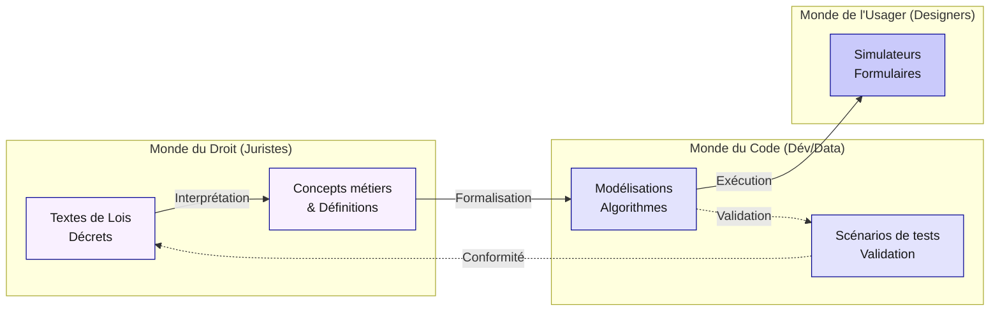
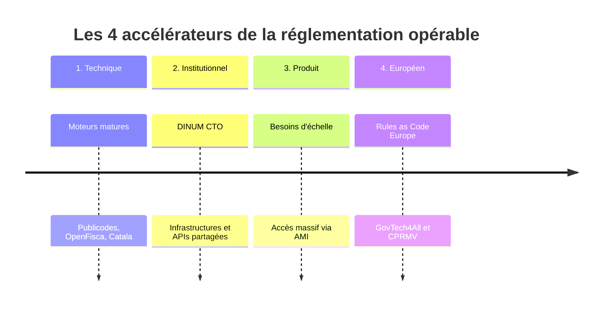
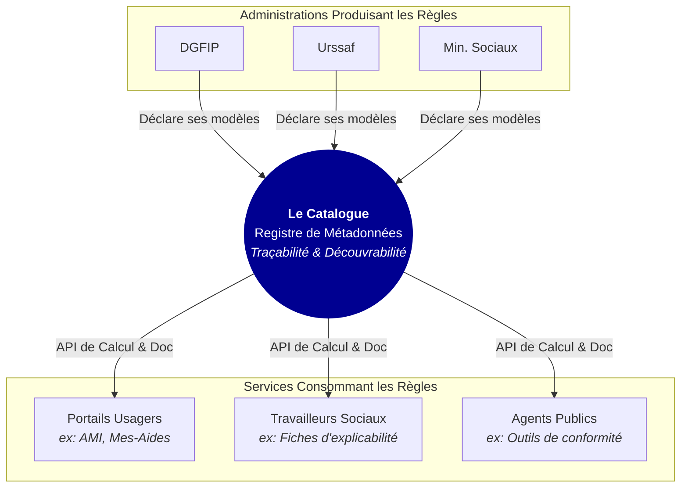
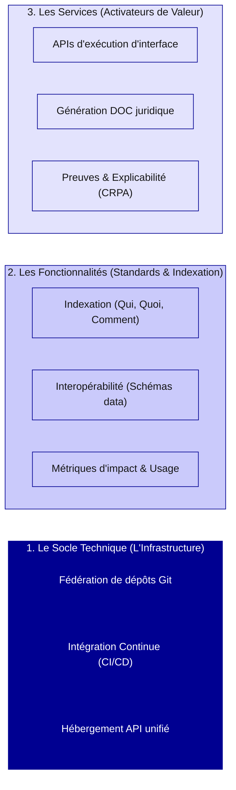
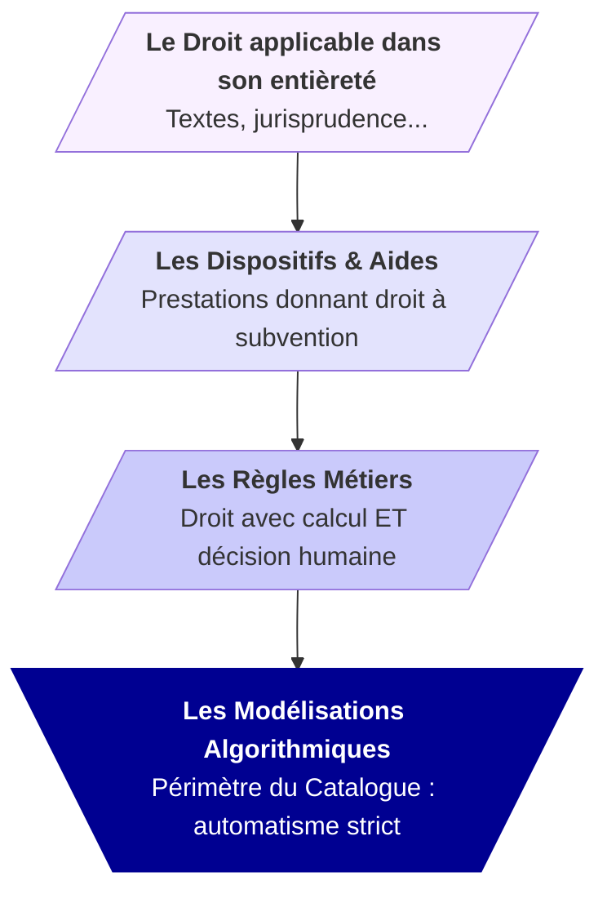
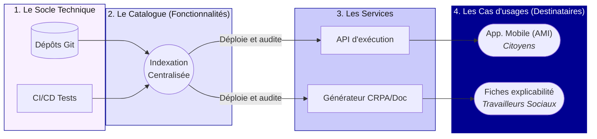
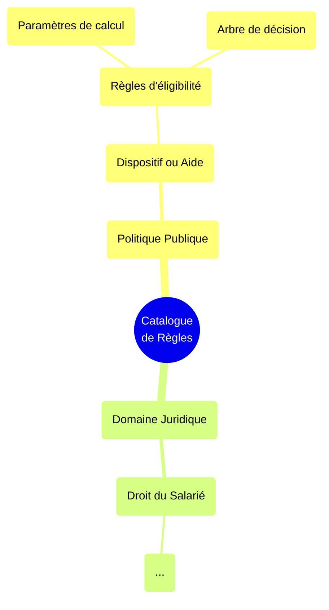
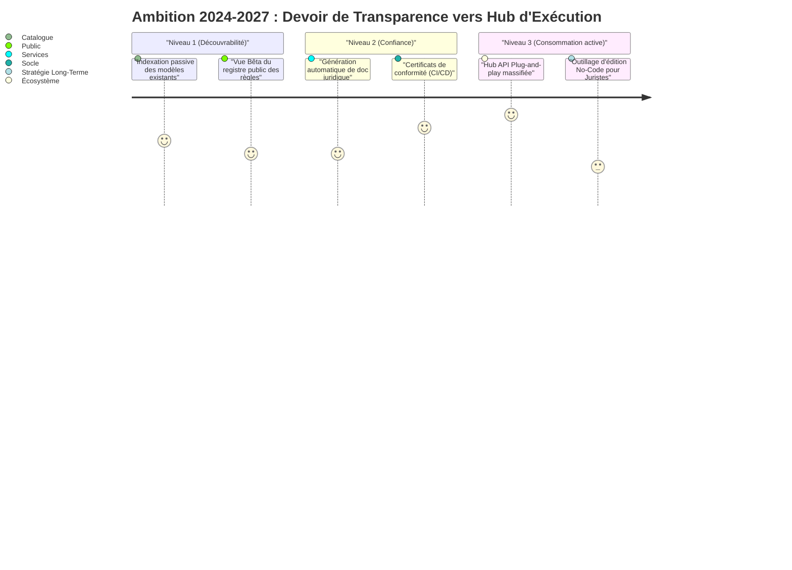

# Propositions de Diagrammes (Mermaid) pour le Catalogue de Règles

Ce document rassemble les propositions de schémas conceptuels (générés via Mermaid.js) destinés à rythmer, "aérer" et clarifier les fondations de la présentation `restitution-catalogue.md`.

Toutes les étiquettes et nœuds ont été rigoureusement échappés pour garantir une compatibilité parfaite avec les moteurs de rendu Markdown/Mermaid stricts.

---

## 1. L'écologie d'artefacts (De la Loi jusqu'à l'Usager)
**Emplacement recommandé** : Section "L'enjeu de politique publique" ou "Les défis posés par la gestion informatique des règles"

---

## 2. La Timeline des 4 Accélérateurs (L'alignement des planètes)
**Emplacement recommandé** : Section "Ce qui a changé"

---

## 3. Le Registre comme "Tiers de Confiance"
**Emplacement recommandé** : Section "La proposition de valeur"

---

## 4. L'Architecture Cible en Couches ("Layered Cake")
**Emplacement recommandé** : Section "L'architecture du système" ou "Du socle technique aux services"

---

## 5. Le "Périmètre Pragmatique" (L'entonnoir de la Loi au Calculable)
**Emplacement recommandé** : Pour expliciter le périmètre exact.

---

## 6. La Chaîne de Valeur Complète (Cœur technique vers Usages externes)
**Emplacement recommandé** : En amont de la section "Quelques cas d'usages porteurs".

---

## 7. La Granularité de l'Information Indexée
**Emplacement recommandé** : Explications de la "fiche" d'une règle dans le catalogue.

---

## 8. Les 3 Cercles de Diffusion (Destinataires)
**Emplacement recommandé** : Section "Des fonctionnalités aux services" ou "Cas d'usages".

```mermaid
flowchart LR
    Cat(("<b>Catalogue de Règles</b><br/>Tiers de confiance<br/>intra-gouvernemental"))

    subgraph C1 ["Cercle 1 : Le cœur de l'État (Usage direct)"]
        AMI["App Mobile. (AMI)"]
        FranceConnect["FranceConnect / API Particulier"]
    end

    subgraph C2 ["Cercle 2 : Partenaires métiers (Standardisation)"]
        CAF["Urssaf / CAF"]
        Guichets["Espaces France Services / CCAS"]
    end

    subgraph C3 ["Cercle 3 : Société Civile (Open Data & Recherche)"]
        Civic["Entreprises / Startups d'État"]
        Recherche["Chercheurs / Observatoires publics"]
    end

    Cat ==>|"APIs robustes<br/>& Confiance forte"| C1
    C1 -.->|"Outils de terrain"| C2
    C2 -.->|"Accès libre"| C3

    style Cat fill:#000091,stroke:#000091,color:#fff
    style C1 fill:#e3e3fd,stroke:#000091,color:#161616
    style C2 fill:#f0f8ff,stroke:#000091,stroke-dasharray: 5 5,color:#161616
    style C3 fill:#fff,stroke:#000091,stroke-dasharray: 2 2,color:#161616
```

---

## 9. Montée en Puissance : Les Niveaux de Maturité
**Emplacement recommandé** : Section "Notre vision à 6 mois" / "Une vision ambitieuse à 3 ans"

